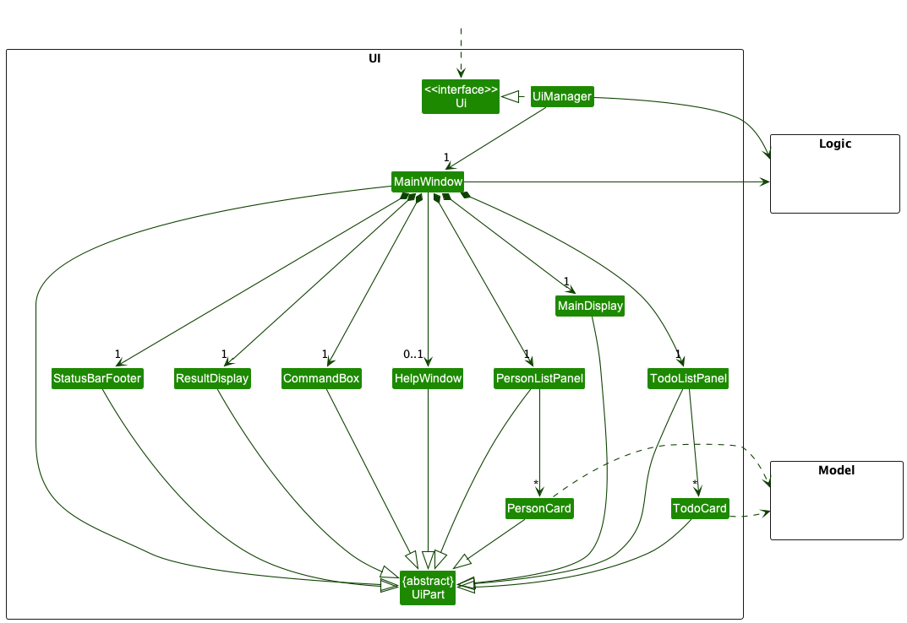
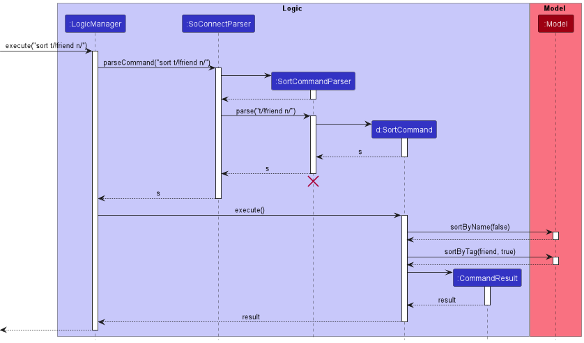
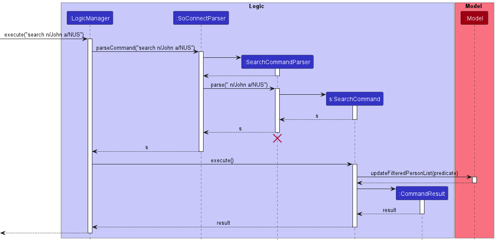
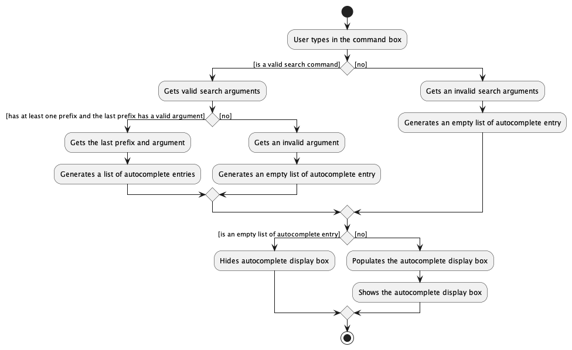
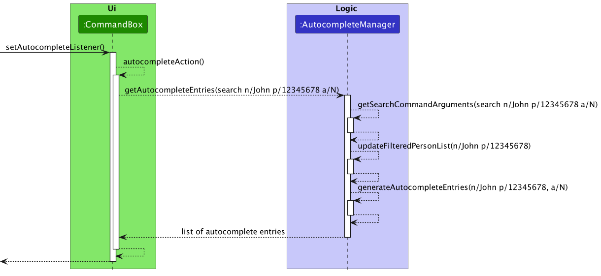
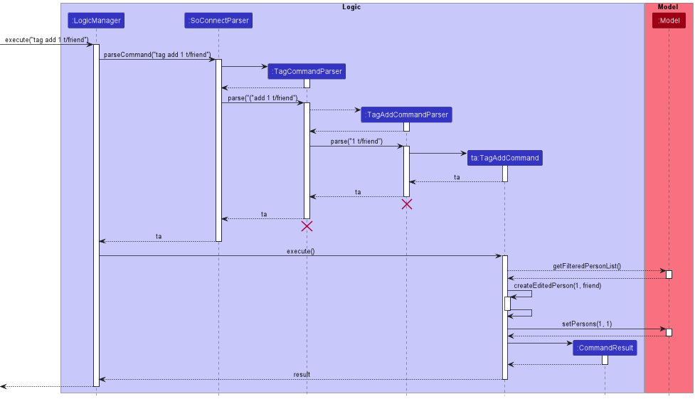
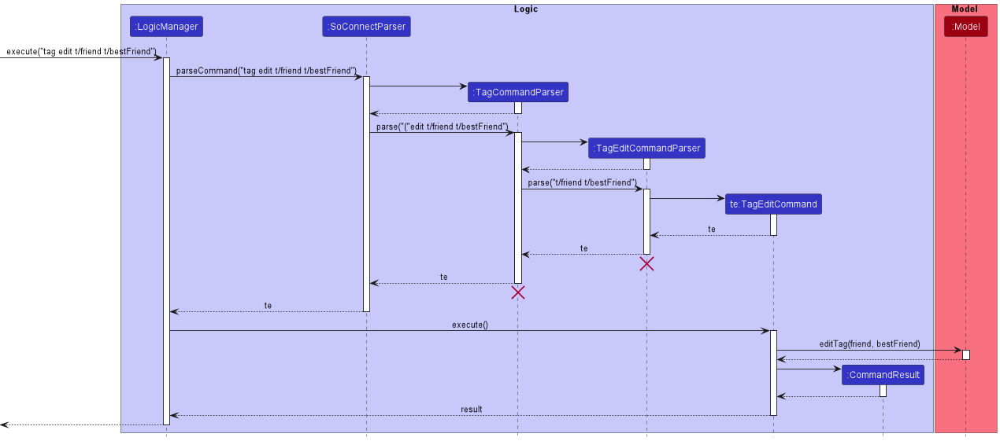
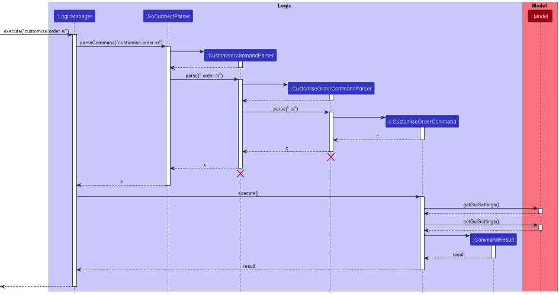

* Table of Contents
{:toc}

--------------------------------------------------------------------------------------------------------------------

## **Acknowledgements**

* This product is adapted from [AddressBook Level-3](https://nus-cs2103-ay2223s1.github.io/tp/).
* Libraries used: [JavaFX](https://openjfx.io/), [Jackson](https://github.com/FasterXML/jackson), [JUnit5](https://github.com/junit-team/junit5).

--------------------------------------------------------------------------------------------------------------------

## **Setting up, getting started**

Refer to the guide [_Setting up and getting started_](SettingUp.md).

--------------------------------------------------------------------------------------------------------------------

## **Design**

:bulb: **Tip:** The `.puml` files used to create diagrams in this document can be found in the [diagrams](https://github.com/AY2223S1-CS2103T-W15-1/tp/tree/master/docs/diagrams/) folder. Refer to the [_PlantUML Tutorial_ at se-edu/guides](https://se-education.org/guides/tutorials/plantUml.html) to learn how to create and edit diagrams.

### Architecture

The ***Architecture Diagram*** given above explains the high-level design of the App.

Given below is a quick overview of main components and how they interact with each other.

**Main components of the architecture**

**`Main`** has two classes called [`Main`](https://github.com/AY2223S1-CS2103T-W15-1/tp/blob/master/src/main/java/soconnect/Main.java) and [`MainApp`](https://github.com/AY2223S1-CS2103T-W15-1/tp/blob/master/src/main/java/soconnect/MainApp.java). It is responsible for:
* At app launch: Initializes the components in the correct sequence and connects them up with each other.
* At shut down: Shuts down the components and invokes cleanup methods where necessary.

[**`Commons`**](#common-classes) represents a collection of classes used by multiple other components.

The rest of the App consists of four components:
* [**`UI`**](#ui-component): The UI of the App.
* [**`Logic`**](#logic-component): The command executor and handles autocomplete.
* [**`Model`**](#model-component): Holds the data of the App in memory.
* [**`Storage`**](#storage-component): Handles reading and writing data to the hard disk.

**How the architecture components interact with each other**

The *Sequence Diagram* below shows how the components interact with each other for the scenario where the user issues the command `delete 1`.

Each of the four main components will:

* Define its *API* in an `interface` with the same name as the Component.
* Implement its functionality using a concrete `{Component Name}Manager` class, which follows the corresponding API `interface` mentioned in the previous point.

For example, the `Logic` component defines its API in the `Logic.java` interface and implements its functionality using the `LogicManager.java` class which follows the `Logic` interface. Other components interact with a given component through its interface rather than the concrete class. This is to prevent the outside component being coupled to the implementation of a component, as illustrated in the partial class diagram below.

The sections below give more details of each component.

### UI component

The **API** of this component is specified in [`Ui.java`](https://github.com/AY2223S1-CS2103T-W15-1/tp/blob/master/src/main/java/soconnect/ui/Ui.java)

The UI consists of a `MainWindow` that is made up of parts, e.g.,`CommandBox`, `ResultDisplay`, `PersonListPanel`, `StatusBarFooter`, etc. All these, including the `MainWindow`, inherit from the abstract `UiPart` class which captures the commonalities between classes that represent parts of the visible GUI.

The `UI` component uses the [JavaFX](https://openjfx.io/) UI framework. The layout of these UI parts are defined in matching `.fxml` files that are present in the `src/main/resources/view` folder. For example, the layout of the [`MainWindow`](https://github.com/AY2223S1-CS2103T-W15-1/tp/blob/master/src/main/java/soconnect/ui/MainWindow.java) is specified in [`MainWindow.fxml`](https://github.com/AY2223S1-CS2103T-W15-1/tp/blob/master/src/main/resources/view/MainWindow.fxml)

The `UI` component does the following:

* Executes user commands using the `Logic` component.
* Listens for changes to `Model` data so that the UI can be updated with the modified data.
* Keeps a reference to the `Logic` component, because the `UI` relies on the `Logic` to execute commands.
* Depends on some classes in the `Model` component, as it displays `Person` and `Todo` objects residing in the `Model`.

### Logic component

**API** : [`Logic.java`](https://github.com/AY2223S1-CS2103T-W15-1/tp/blob/master/src/main/java/soconnect/logic/Logic.java)

Below is a partial class diagram of the `Logic` component.

How the `Logic` component works:
1. When `Logic` is called upon to execute a command, it uses the `SoConnectParser` class to parse the user command.
2. This results in a `Command` object (more precisely, an object of one of its subclasses e.g., `AddCommand`) which is executed by the `LogicManager`.
3. The command can communicate with the `Model` when it is executed (e.g., to add a contact).
4. The result of the command execution is encapsulated as a `CommandResult` object which is returned from `Logic`.

The Sequence Diagram below illustrates the interactions within the `Logic` component for the `execute("delete 1")` API call.

:information_source: **Note:** The lifeline for `DeleteCommandParser` should end at the destroy marker (X), but due to a limitation of PlantUML, the lifeline reaches the end of diagram.

Here are the other classes in `Logic` (omitted from the class diagram above) that are used for parsing a user command:

How the parsing works:

* When called upon to parse a user command, the `SoConnectParser` class creates an `XYZCommandParser` (`XYZ` is a placeholder for the specific command name e.g., `AddCommandParser`) which uses the other classes shown above to parse the user command and create a `XYZCommand` object (e.g., `AddCommand`) which the `SoConnectParser` returns back as a `Command` object.
* All `XYZCommandParser` classes (e.g., `AddCommandParser`, `DeleteCommandParser`, etc.) inherit from the `Parser` interface so that they can be treated similarly where possible, e.g., during testing.

Here are the other classes in `Logic` (omiited from the class diagram above) that are used for autocompleting a user's search command:

How the autocompleting works:
* When called upon to autocomplete a user's search command, the `AutocompleteManager` classes uses the other classes shown above to autocomplete and create a list of autocomplete entries.
* The list of autocomplete entries will be passed to `CommandBox` for display.

### Model component
**API** : [`Model.java`](https://github.com/AY2223S1-CS2103T-W15-1/tp/blob/master/src/main/java/soconnect/model/Model.java)

The `Model` component does the following:

* Stores the SoConnect data, i.e., all `Person` objects and all `Todo` objects (which are contained in a `UniquePersonList` object and a `UniqueTodoList` object respectively).
* Stores the currently 'selected' `Person` or `Todo` objects (e.g., results of a search query) as a separate _filtered_ list which is exposed to outsiders as an unmodifiable `ObservableList` that can be 'observed' (e.g., the UI can be bound to this list so that the UI automatically updates when the data in the list change).
* Stores a `UserPref` object that represents the user’s preferences. This is exposed to the outside as a `ReadOnlyUserPref` objects.
* Does not depend on any of the other three components (as the `Model` represents data entities of the domain, they should make sense on their own without depending on other components).

:information_source: **Note:** An alternative (arguably, a more OOP) model is given below. It has a `Tag` list in the `SoConnect`, which `Person` references. This allows `SoConnect` to only require one `Tag` object per unique tag, instead of each `Person` needing their own `Tag` objects.  

### Storage component

**API** : [`Storage.java`](https://github.com/AY2223S1-CS2103T-W15-1/tp/blob/master/src/main/java/soconnect/storage/Storage.java)

The `Storage` component does the following:
* Saves both SoConnect data and user preference data in `json` format, and read them back into corresponding objects.
* Inherits from `SoConnectStorage`, `TodoListStorage`, and `UserPrefStorage`, which means it can be treated as any one of them (if only one of the functionality is needed).
* Depends on some classes in the `Model` component (because the `Storage` component's job is to save/retrieve objects that belong to the `Model`).

### Common classes

Classes used by multiple components are in the `soconnect.commons` package.

--------------------------------------------------------------------------------------------------------------------

## **Implementation**

This section describes some noteworthy details on how certain features are implemented.

### Sorting feature

#### Implementation

The sorting mechanism is facilitated by `SortCommand` and `SortCommandParser`. 
Additionally, the mechanism utilises the following operations in `UniquePersonList` to carry out sorting:

* `UniquePersonList#sortByName(Boolean isReverse)` — Sorts the list of contacts by **Name** in alphabetical order.
* `UniquePersonList#sortByPhone(Boolean isReverse)` — Sorts the list of contacts by **Phone** number in increasing order.
* `UniquePersonList#sortByEmail(Boolean isReverse)` — Sorts the list of contacts by **Email** in alphabetical order.
* `UniquePersonList#sortByAddress(Boolean isReverse)` — Sorts the list of contacts by **Address** in alphabetical order.
* `UniquePersonList#sortByTag(Tag tag, Boolean isReverse)` — Sorts the list of contacts by a specified **Tag**. Contacts containing it will be at the top of the list.

These operations sort in reverse order when `isReverse` is true.

These operations are exposed in the `Model` interface under the same method signature.

Given below is an example usage scenario and how the sorting mechanism behaves at each step.

Step 1. The user enters `sort t/!friend n/` command to perform a multi-level sort. `SortCommandParser` calls `ArgumentTokenizer#tokenizeToList()` to separate the parameters of `t/!friend` and `n/`. The separated parameters are stored in a list that preserves the order that the user entered them in. `SortCommandParser` checks the list to confirm that at least 1 valid parameter has been entered.

Step 2. Each parameter is processed by `SortCommandParser#convertArguments`. They are checked for reversed sorting through the presence of `!`. The `friend` string is checked to see if it fulfils the requirements of the `Tag` class. If the user entered string values for non-`Tag` parameters (`n/NAME`, `p/PHONE`, `e/EMAIL`, `a/ADDRESS`), the string values are ignored and the command continues execution as per normal.

Step 3. The `sort` command sorts the currently displayed list by **Name** first, calling `Model#sortByName(Boolean isReverse)` where `isReverse = false`.

Step 4. The `sort` command reverse sorts the currently displayed list by the `friend` **Tag** next, calling `Model#sortByTag(Tag tag, Boolean isReverse)` where `isReverse = true`.

The following sequence diagram shows how the sort operation works:

:information_source: **Note:** The lifeline for `SortCommandParser` should end at the destroy marker (X) but due to a limitation of PlantUML, the lifeline reaches the end of diagram.

Step 5. The user is shown the sorted list of contacts. The sorted list contains the same contacts as the previous displayed list. It has two sections, the first section contains contacts without the `friend` tag and the second section contains contacts with the `friend` tag. Each section is sorted by **Name** in alphabetical order.

#### Design consideration

**Aspect: How to implement multi-level sorting:**

* **Alternative 1 (current choice):** Sort the list once for each parameter entered by the user.
    * Pros: Easy to implement.
    * Cons: May have performance issues in terms of time needed to sort.

* **Alternative 2:** Single composite sorting method that combines all the individual sorting for each parameter.
    * Pros: Save time as only 1 sorting operation is carried out.
    * Cons: Harder to modify when more parameters are added. Can result in more bugs due to complexity.

### Search feature

#### Implementation

The search mechanism is facilitated by `SearchCommand` and `SearchCommandParser`.

This feature allows user to customise the contacts displayed based on the information provided. For example, user can decide to have specific search result that satisfies all the conditions or to have more generic result that only satisfies one of the conditions.

It implements the following main operations:

* `SearchCommand#execute(Model model)` — Updates _filtered_ person list to contain contacts that match the search query.
* `SearchCommandParser#parse()` — Parses search query based on the condition and information specified.

Given below is an example usage scenario and how the search mechanism behaves at each step.

Step 1. The user executes `search n/John a/NUS` command to perform a joint search. `SearchCommandParser` calls `ArgumentTokenizer#tokenize` to group the search parameters according to the prefix `/n` and `/a`.

Step 2. The `search` command search the SoConnect by matching the search parameters and condition with the available contact information, calling `StringUtil#containsKeywordsIgnoreCase(String sentence, String keywords)`.

Step 3. The `search` command then updates _filtered_ person list to contains the matching contacts. If no matching contact is found,
 the `search` command will call `StringUtil#containsSomeKeywordsIgnoreCase(String sentence, String keywords)` to search for contacts that match partially to the search parameters.

The following sequence diagram shows how the search operation works:

:information_source: **Note:** The lifeline for `SearchCommandParser` should end at the destroy marker (X) but due to a limitation of PlantUML, the lifeline reaches the end of diagram.

Step 4. The user is shown the _filtered_ list. The _filtered_ list contains all contacts that are relevant to the user's search query.

#### Design consideration

**Aspect: How to implement searching:**

* **Alternative 1 (current choice):** Search the list once for each parameter entered by the user.
    * Pros: Easy to implement.
    * Cons: May have performance issues in terms of time needed to search.

* **Alternative 2:** Single complex searching method that combines all the individual searching for each parameter.
    * Pros: Save time as only 1 search operation is carried out.
    * Cons: Harder to modify when more parameters are added. Can result in more bugs due to complexity.

_{more aspects and alternatives to be added}_

### Autocomplete Feature

#### Implementation

The autocomplete mechanism is facilitated by `AutocompleteManager` and `CommandBox`. T`AutocompleteManager` contains a `UniquePersonList` which is used to filter and generate a list of autocomplete entries. The `CommandBox` calls methods from `AutocompleteManager` to get a list of autocomplete entries.

The main methods in `AutocompleteManager` are:
- `getAutocompleteEntries(String userInput)` - Gets a list of autocomplete entries.
- `getSearchCommandArguments(String userInput)` - Gets the arguments from the command if command is a search command,
otherwise an invalid argument.
- `getLastPrefixArguemnt(String argsString, Prefix... prefixes` - Gets the last prefix and argument from the
`argsString`.
- `updateFilteredPersonList(String argsString)` - Updates the `UniquePersonList` with filter.
- `generateAutocompleteEntries(String argsWithoutLastPrefixArguement, String lastPrefixArgument)` - Generates a list of
autocomplete entries by completing the sentence of the `lastPrefixArgument`.

The main methods in `CommandBox` are:
- `setAutocompleteListener()` - A listener that triggers `autocompleteAction` whenever user presses a key on the keyboard.
- `autocompleteAction()` - Gets a list of autocomplete entries from `AutocompleteManager` and displays it.
- `populatePopup(List<String> autocompleteEntries, String originalSearchInput)` - Fills up the autocomplete display box with the autocomplete entries.

This feature is an enhancement on the [**search feature**](#search-feature) (i.e. it only works when user is doing a searching). It only autocompletes the last prefix and argument of the user input.

Given below is an example usage scenario and how the autocomplete mechanism behaves at each step.

Step 1. The user enters `search n/John p/12345678 a/N` in the `CommandBox`. The `CommandBox#setAutocompleteListener()` calls `CommandBox#autocompleteAction()` as a key is pressed when the user types the command.

:information_source: **Note:** At this step, the command is not executed yet as the user has not pressed the enter key.

Step 2. The `CommandBox#autocompleteAction()` calls `AutocompleteManager#getAutocompleteEntries(String userInput)` to get a list of autocomplete entries.

Step 3. The `AutocompleteManager#getSearchCommandArguments(String userInput)` will check if the command is a valid search command and return the valid search command arguments, otherwise an invalid argument and `AutocompleteManager`will return an empty list to `CommandBox`. Hence, for user input `search n/John a/N`, the valid search command arguments is `n/John p/12345678 a/N`.

Step 4. The search command arguments will be passed to `AutocompleteManager#getLastPrefixArgument(String argsString, Prefix... prefixes)` to get the last prefix and argument. If there is no valid last prefix and argument found, it will then return an invalid argument and similarly, `AutocompleteManager` returns an empty list to `CommandBox`. Given `n/John p/12345678 a/NUS`, the last prefix and argument is `a/N` where `a/` is the prefix and `N` is the argument.

Step 5. The `AutocompleteManager#updateFilteredPersonList(String argsString)` takes in the arguments without the last prefix and argument - `n/John p/12345678` and filters the `UniquePersonList` based on the condition and contact information available in ` n/John p/12345678`.

:information_source: **Note:** For `OR` condition, no filter will be applied to `UniquePersonList` (i.e. this returns every person in the list). This is because when the user wants to perform an `OR` condition search, the `Person` in `UniquePersonList` only has to satisfy one of the arguments given. Since we are autocompleting only the last prefix and argument, the `Person` in `UniquePersonList` will only need to satisfy the last prefix and argument.

Step 6. After the `UniquePersonList` is filtered, `AutocompleteManager#generateAutocompleteEntries(String argsWithoutLastPrefixArgument, String lastPrefixArgument)` will filter the filtered `UniquePersonList` with the last prefix and argument to generate a list of autocomplete entries.

For example, the filtered `UniquePersonList` has `Person1 - {n/John Loh, p/12345678, a/NUS}`, `Person2 - {n/John Teo, p/12345678, a/NTU}` and `Person3 - {n/John Wong, p/12345678, a/SMU}`. A filter and autocomplete will be done using the last prefix and argument - `a/N`, so this will filter out `Person3` as the person's address `a/SMU` does not match with `a/N`. After filtering, the prefix and argument will be autocompleted and the list of autocomplete entries will be return to `CommandBox`.

:information_source: **Note:** The example, `Person1 - {n/John Loh, p/12345678, a/NUS}`, used above means the
`UniquePersonList` has a `Person` with information `n/John Loh`, `p/12345678` and `a/NUS`.

Step 7. The `CommandBox#autocompleteAction` will pass the list of autocomplete entries to `CommandBox#populatePopup(List<String> autocompleteEntries, String originalSearchInput)` to populate the autocomplete display box with the autocomplete entries and display to the user.

The following activity diagram summarizes what happens when a user types a command in the `CommandBox`:

The following sequence diagram shows how the autocomplete operation works:

#### Design consideration

**Aspect: How to generate autocomplete entries:**

* **Alternative 1 (current choice):** Use the streams feature in Java to filter the `UniquePersonList` and get the
autocomplete entries.
    * Pros: Easy to implement, many useful operations available.
    * Cons: Less efficient as more time to compare the strings.

* **Alternative 2:** Implement a trie data structure to store information and obtain the autocomplete entries from
the trie data structure.
    * Pros: More efficient way to searching a string.
    * Cons: More memory to store the strings. Have to refactor and modify the existing class and methods.

### Tag adding feature

#### Implementation

The tag adding mechanism is facilitated by `TagAddCommand` and `TagAddCommandParser`.
Additionally, The mechanism utilises the following operations in `UniqueTagList` and `UniquePersonList`.

* `UniqueTagList#hasTag(Tag tag)` - Checks if the tagList has the tag.
* `UniquePersonList#setPerson(Person target, Person editedPerson)` - Sets the same person with the new tag.

These operations are exposed in the `Model` interface under the same method name.

Given below is an example usage scenario and how the tag adding mechanism behaves at each step.

Step 1. The user executes `tag add 1 t/friend` command to add the tag, `friend`, to the contact indicated by the `INDEX`, 1.
`TagAddCommandParser` calls  `ArgumentTokenizer#tokenizeToList()` to separate the parameters of `1` and `t/friend`.

Step 2. The `tag add` command collects the list of contacts shown, containing them in `Model#getFilteredPersonList()`.

Step 3. The `tag add` command recreates the same contact and adds the new tag, containing this new contact in `TagAddCommand#createEditedPerson(Person personToEdit, Tag tag)`.

Step 4. The `tag add` command replaces the old contact with the new, updated contact, calling `Model#setPerson(Person target, Person editedPerson)`.

The following activity diagram summarizes what happens when a user executes a tag add command:

:information_source: **Note:** The lifeline for `TagAddCommandParser` and `TagCommandParser` should end at the destroy marker (X) but due to a limitation of PlantUML, the lifeline reaches the end of diagram.

Step 5. The contact indicated by `INDEX` now has the `friend` tag.

#### Design consideration

**Aspect: How to implement tag add:**

* **Alternative 1 (current choice):** Creates a new contact with the tag included.
    * Pros: Prevents direct access into the tags of a contact.
    * Cons: Potential error occurs if some form of duplication is allowed.

* **Alternative 2:** Directly add the tag into the contact .
    * Pros: Easy to implement.
    * Cons: Easy to access into the tags of a contact. Could cause accidental bugs.

### Tag editing feature

The tag adding mechanism is facilitated by `TagEditCommand` and `TagEditCommandParser`.
Additionally, The mechanism utilises the following operations in `UniqueTagList`, `UniquePersonList` and `UniqueTodoList`.

* `UniqueTagList#editTag(Tag oldTag, Tag newTag)` - Changes the old tag with the new tag.
* `UniquePersonList#changeRelevantPersonTag(oldTag, newTag)` - Updates every person who has the old tag with the new tag.
* `UniqueTodoList#changeRelevantTodoTag(Tag oldTag, Tag newTag)` -  Updates every task which has the old tag with the new tag.

These operations are exposed in the `Model` interface under the same method name.

Given below is an example usage scenario and how the tag editing mechanism behaves at each step.

Step 1. The user executes `tag edit t/friend t/bestFriend` command to edit the old tag, `friend`, to the new tag, `bestFriend`.
`TageditCommandParser` calls  `ArgumentTokenizer#tokenizeToList()` to separate the parameters of `t/friend` and `t/bestFriend`.

Step 2. The `tag edit` command edits the old tag with the new tag, calling `Model#editTag(oldTag, newTag)`.

The following activity diagram summarizes what happens when a user executes a tag add command:

:information_source: **Note:** The lifeline for `TagEditCommandParser` and `TagCommandParser` should end at the destroy marker (X) but due to a limitation of PlantUML, the lifeline reaches the end of diagram.

Step 3. The old tag on every contact and every task is now replaced with the new tag for display.

#### Design consideration

**Aspect: How to implement tag edit:**

* **Alternative 1 (current choice):** Creates a new tag and replaces the old tag with the new one.
    * Pros: Prevents direct access into the information of a tag.
    * Cons: Tedious. Necessary to manually change the old tag in every contact and every task.

* **Alternative 2:** Change the tag's name.
    * Pros: Easy to implement.
    * Cons: Can potentially introduce bugs due to direct access into the tag's implementation.

_{Explain here how the data archiving feature will be implemented}_

### Customise Order Feature

#### Implementation

This feature is mainly implemented by the `CustomiseOrderCommand` and `PersonCard` classes. The following methods are the main ones:

* `CustomiseOrderCommand#execute()` - saves the new attribute order in the `preferences.json` file by calling `Model#setGuiSettings()`.
* `PersonCard#setAttributes()` - reads the order from the `preferences.json` file and builds the `PersonCard` in the order specified.

Given below is an example usage scenario and how this feature behaves at each part of the mechanism.

Step 1. The user launches the application. The user sees a list of contacts, each contact contains a name, a phone number, an email, an address and possibly some tags. Under each contacts' name, the current order the user sees is: `TAGS`, `PHONE`, `EMAIL` and `ADDRESS` (this is also the default order).

:information_source: **Note:** The name will always be at the top of each contact as it is the most crucial information of each contact.

Step 2. The user executes `customise order e/` as the user wants the emails appear right below the name.

Step 3. `SoConnectParaser` processes the input and calls the parser `CustomiseCommandParser` to parse `" order e/"`.

Step 4. `CustomiseCommandParser` processes the input and calls the parser `CustomiseOrderCommandParser` to parse `" e/"`.

Step 5. `CustomiseOrderCommandParser` processes the input into a list of attributes. In this case, the list of attributes only contains `EMAIL` and is missing the attributes `TAGS`, `PHONE` and `ADDRESS`. The missing attributes are added to the list according to the default order mentioned above. The list of attributes now contains `EMAIL`, `TAGS`, `PHONE` and `ADDRESS`.

Step 6. `CustomiseOrderCommandParser` creates a `CustomiseOrderCommand` with the list of attributes.

Step 7. `CustomiseOrderCommandParser` returns the `CustomiseOrderCommand`.

Step 8. `Logic` executes the `CustomiseOrderCommand`.

Step 9. `CustomiseOrderCommand#execute()` calls `Model#setGuiSettings()` to save the new attribute order in `preferences.json`.

The following sequence diagram illustrates Steps 3 to 9:

:information_source: **Note:** The lifeline for `CustomiseOrderCommandParser` and `CustomiseCommandParser` should end at the destroy marker (X) but due to a limitation of PlantUML, the lifeline reaches the end of diagram.

Step 10. The user sees the new ordering after `PersonCard#setAttributes()` sets the attributes based of the new order in `preferences.json`.

:information_source: **Note:** If the user closes the application and relaunches the application, the attributes are still in the same order that the user set previously.

#### Design consideration
* **Alternative 1 (current choice):** Sets the order by using 4 placeholder JavaFX `FlowPane`.
  * Pros: Easy to implement.
  * Cons: Hard to maintain if different styling required for different attributes.

* **Alternative 2:** Have 24 different FXML files and use the one that is in the required order.
  * Pros: Easy to implement.
  * Cons: Harder to maintain and make changes.

--------------------------------------------------------------------------------------------------------------------

## **Documentation, logging, testing, configuration, dev-ops**

* [Documentation guide](Documentation.md)
* [Testing guide](Testing.md)
* [Logging guide](Logging.md)
* [Configuration guide](Configuration.md)
* [DevOps guide](DevOps.md)

--------------------------------------------------------------------------------------------------------------------

## **Appendix: Requirements**

### Product scope

**Target user profile**: NUS SoC Student

* Has a need to manage a significant number of contacts and tasks (from NUS modules and co-curricular activities).
* Prefers desktop apps over other types (easy access to laptop for NUS/SoC modules).
* Can type fast (from SoC coding modules).
* Prefers typing to mouse interactions (from SoC coding modules).
* Is reasonably comfortable using CLI apps (from SoC coding modules).

**Value proposition**:

* Manage contacts and tasks faster than a typical mouse/GUI driven app.
* Organise and separate their school contacts from personal contacts.
* Organise and separate their school tasks from personal tasks.
* Practice and train their typing speed.
* Increase their familiarity with using CLI tools.

### User stories

Priorities: High (must have) - `* * *`, Medium (nice to have) - `* *`, Low (unlikely to have) - `*`

| Priority | As a …                  | I want to …                                            | So that I can…                                                             |
|----------|-------------------------|--------------------------------------------------------|----------------------------------------------------------------------------|
| `* * *`  | new user                | see usage instructions                                 | refer to instructions when I forget how to use the App                     |
| `* * *`  | user                    | add a new contact                                      |                                                                            |
| `* * *`  | user                    | delete a contact                                       | remove entries that I no longer need                                       |
| `* * *`  | user                    | view all my contacts                                   | keep track of all my contacts in one place                                 |
| `* *`    | user                    | edit a contact                                         | update it or correct mistakes                                              |
| `* *`    | user                    | clear all my contacts                                  | save time deleting them one by one                                         |
| `* *`    | user                    | create a new tag                                       | categorise my contacts                                                     |
| `* *`    | user                    | delete a tag                                           | remove redundant tags                                                      |
| `* *`    | user                    | edit a tag                                             | provide better naming                                                      |
| `* *`    | user                    | tag a contact                                          | add it to a category                                                       |
| `* *`    | user                    | untag a contact                                        | remove it from a category                                                  |
| `* *`    | user                    | search using a name, phone number, email or address    | find a contact easily without reading through the list                     |
| `* *`    | user                    | search with a tag                                      | find groups of contacts that share a common tag                            |
| `* *`    | user                    | search with multiple tags                              | narrow my search results to only contacts that have all the specified tags |
| `* *`    | user                    | search with multiple tags                              | broaden my result results to contacts that have any of the specified tags  |
| `* *`    | user                    | view contacts related to my search query               | find contacts even when I mistype their name                               |
| `* *`    | user                    | hide contact details                                   | focus on certain information of each contact                               |
| `* *`    | user                    | show contact details                                   | view certain information of each contact                                   |
| `*`      | user                    | customise the order of information for contacts        | view more important information before others                              |
| `* *`    | user                    | have an autocomplete for my current search query       | search faster by names and minimize the chance of an unsuccessful search   |
| `* *`    | user with many contacts | specify the default order of my contacts               | avoid re-sorting the list everytime                                        |
| `* *`    | user with many contacts | sort contacts by name, email, phone number, or address | organise my contacts list                                                  |
| `* *`    | user with many contacts | sort contacts according to tags                        | view contacts with a specified tag before other contacts                   |
| `* *`    | user with many contacts | sort contacts by multiple fields                       | organise my contacts list with greater degree                              |
| `* *`    | user                    | add a new todo                                         |                                                                            |
| `* *`    | user                    | delete a todo                                          | remove a todo that I have completed                                        |
| `* *`    | user                    | edit a todo                                            | update it or correct my mistakes                                           |
| `* *`    | user                    | clear all my todos                                     | save time on deleting them one by one                                      |
| `* *`    | user                    | filter the list of todos shown                         | only view the portion of list I need at the moment                         |

### Use cases

(For all use cases below, the **System** is the `SoConnect` and the **Actor** is the `user`, unless specified otherwise)

**Use case: Delete a contact**

**MSS**

1.  User requests to list contacts.
2.  SoConnect shows a list of contacts.
3.  User requests to delete a specific contact in the list.
4.  SoConnect deletes the contact.

    Use case ends.

**Extensions**

* 1a. The list is empty.

  Use case ends.

* 3a. The given index is invalid.

    * 3a1. SoConnect shows an error message.

      Use case resumes at step 2.

**Use case: Search contacts**

**MSS**

1.  User requests to search a specific word in the list.
2.  SoConnect shows a list of contacts related to the word.

    Use case ends.

**Extension**
* 1a. The list is empty.

  Use case ends.

* 3a. There is no input after search.

    * 3a1. SoConnect shows an error message and the same list of contacts.

      Use case ends.

**Use case: Edit a tag**

**MSS**

1.  User requests for list of tags.
2.  SoConnect shows the list of tags.
3.  User changes a tag.
4.  SoConnect updates the tag.

    Use case ends.

**Extensions**

* 1a. There are no tags.

  Use case ends.

* 3a. There is no such current tag.

    * 3a1. SoConnect shows an error message.

      Use case resumes at step 2.

* 3b. The new tag already exist.

    * 3b1. SoConnect shows an error message.

      Use case resumes at step 2.

**Use case: Add tag to Contact**

**MSS**

1.  User requests for the contact.
2.  SoConnect gives the contact.
3.  User requests to add tag to the contact.
4.  SoConnect adds the tag to the contact.

    Use case ends.

**Extensions**

*  1a. There is no such name in the contacts.

    * 1a1. SoConnect shows an error message.

      Use case resumes at step 1.

*  3a. There is no such tag in the taglist.

    * 3a1. SoConnect shows aan error message.

      Use case resumes at step 2.

**Use case: Sort by name**

**MSS**

1.  User enters command to sort the contact list by name.
2.  SoConnect sorts the list by name and displays the new list.

    Use case ends.

**Use case: Hide phone number of all contacts**

**MSS**

1. User requests phone number to be hidden.
2. SoConnect no longer displays phone number of each contact.

   Use case ends.

**Use case: Show phone number of all contacts**

**MSS**

1. User requests phone number to be shown.
2. SoConnect now displays phone number of all contacts.

   Use case ends.

**Use case: Order contact details**

**MSS**

1. User requests details to be shown in the following order: address, email, phone number, tags.
2. SoConnect now displays in the following order: address, email, phone number, tags.

   Use case ends.

### Non-Functional Requirements

1. Should work on any _mainstream OS_ as long as it has Java `11` or above installed.
2. Should be able to hold up to 1000 contacts and todos without a noticeable sluggishness in performance for typical usage.
3. A user with above average typing speed for regular English text (i.e. not code, not system admin commands) should be able to accomplish most of the tasks faster using commands than using the mouse.
4. Should be for a single user i.e. (not a multi-user product).
5. Should have its data stored locally and the data should be in a human editable text file.
6. Should not use a Database Management System for data storage.
7. Should work without requiring an installer.
8. Should not depend on a remote server.
9. Should not cause any resolution-related inconveniences to the user.
10. Should be packaged in a single JAR file and its size should not exceed 100MB.
11. Should not have hard-to-test features or features that make the product hard-to-test, i.e., features that require creating user accounts, login, logout etc., audio-related features and Features that depend heavily on remote APIs.

### Glossary

* **Mainstream OS**: Windows, Linux, Unix, OS-X.
* **CLI**: A text-based user interface used to run programs.
* **GUI**: A graphical user interface (GUI) is a form of user interface that allows users to interact with programs through graphical icons and audio indicator.
* **JavaFX**: A Java library used to develop client applications.
* **kLoC**: Stands for thousands of lines of code.
* **NUS**: National University of Singapore.
* **SoC**: School of Computing, a computing school in NUS.
* **Private Contact Detail**: A contact detail that is not meant to be shared with others.
* **Autocomplete**: A feature that shows a list of completed words or strings without the user needing to type them in full.
* **Autocomplete Entry:** A sentence that has been completed with autocomplete.
* **Todo**: A task that the user needs to complete.

--------------------------------------------------------------------------------------------------------------------

## **Appendix: Instructions for manual testing**

Given below are instructions to test the app manually.

:information_source: **Note:** These instructions only provide a starting point for testers to work on;
testers are expected to do more *exploratory* testing.

### Launch and shutdown

1. Initial launch.

   1. Download the jar file and copy into an empty folder.

   1. Double-click the jar file Expected: Shows the GUI with a set of sample contacts and todos. The window size may not be optimum.

2. Saving window preferences.

   1. Resize the window to an optimum size. Move the window to a different location. Close the window.

   2. Re-launch the app by double-clicking the jar file. 
       Expected: The most recent window size and location is retained.

### Contact Management
   
#### Adding a contact

1. Adding a new contact.
   1. Prerequisite: There is no contact named `John Doe`.
   2. Test case: `add n/John Doe p/98765432 e/johnd@example.com a/John street, block 123, #01-01`.
   3. Expected: New contact with the same details added in the contact list.
2. Adding a contact that has existed before.
   1. Prerequisite: There is a contact named `Betsy Crowe` in the contact list.
   2. Text case: `add n/Betsy Crowe t/friend e/betsycrowe@example.com a/Newgate Prison p/1234567`.
   3. Expected: Error message `This person already exists in the SoConnect.` is displayed.
   
#### Editing a contact

1. Editing an existing contact.
   1. Prerequisite: There is a contact in the 2nd index of contact list and no existing contact has the name Betsy Crower.
   2. Test case: `edit 2 n/Betsy Crower`.
   3. Expected: Edits the name of the 2nd contact to be Betsy Crower.
   
#### Listing all contacts

1. Prerequisite: There are some existing contacts.
2. Test case: `list`.
3. Expected: Display all contacts.

#### Searching for a contact

1. Searching an existing contact.
   1. Prerequisite: There is a contact named `Susan` in the contact list.
   2. Test case: `search n/susan`.
   3. Expected: Display all contacts that contain `susan` as name, including `Susan`.

#### Sorting contacts

1. Prerequisite: There are some existing contacts.
2. Test case: `sort n/`.
3. Expected: Display all contacts with the names sorted from A - Z.

#### Deleting a contact

1. Deleting a contact while all contacts are being shown.

   1. Prerequisites: List all contacts using the `list` command. Multiple contacts in the list.

   1. Test case: `delete 1`. 
      Expected: First contact is deleted from the list. Details of the deleted contact shown in the status message. Timestamp in the status bar is updated.

   1. Test case: `delete 0`. 
      Expected: No contact is deleted. Error details shown in the status message. Status bar remains the same.

   1. Other incorrect delete commands to try: `delete`, `delete x`, `...` (where x is larger than the list size) 
      Expected: Similar to previous.

#### Clearing all contacts

1. Prerequisite: There are some existing contacts.
2. Test case: `clear`.
3. Expected: All contacts are erased.

### Todo Management

#### Adding a todo

1. Adding a new todo.
   1. Prerequisite: There is an existing `CS2100` tag and no existing todo has the details that will be provided below. 
   2. Test case: `todo add d/Watched recorded videos for CS2100 date/24-10-2022 pr/low t/CS2100`.
   3. Expected: New todo with the same details is shown in the list.

#### Editing a todo

1. Editing an existing todo.
   1. Prerequisite: There is a todo in the 1st index of contact list.
   2. Test case: `todo edit 1 d/Read notes for ST2334`.
   3. Expected: Edits the description of the 1st todo to be Read notes for ST2334.

#### Deleting a todo

1. Prerequisite: There is a todo in the 2nd index of contact list.
2. Test case: `todo delete 2`.
3. Expected: Todo in the 2nd index is deleted and is no longer shown.

#### Clearing all todos

1. Prerequisite: There are some existing todos.
2. Test case: `todo clear`.
3. Expected: All todos are erased.

#### Filtering todos shown

1. Showing all todos
   1. Prerequisite: There are some existing todos.
   2. Test case: `todo show`.
   3. Expected: All todos are shown.

### Tag Management

#### Creating a tag

1. Prerequisite: There is no tag named `math`.
2. Test case: `tag create t/math`.
3. Expected: A new `math` tag is created.

#### Deleting a tag

1. Prerequisite: There is a tag named `english`.
2. Test case: `tag delete t/english`.
3. Expected: The `english` tag is deleted and can no longer be used.

#### Editing a tag

1. Prerequisite: There is a tag named `english` and there isn't a tag named `literature`.
2. Test case: `tag edit t/english t/literature`.
3. Expected: The `english` tag is now shown as `literature`.

#### Adding a tag to a contact

1. Prerequisite: There is a tag named `english` and a contact in the 1st index in the contact list.
2. Test case: `tag add 1 t/english`.
3. Expected: The `english` tag is attributed to the contact in the 1st index.

#### Removing a tag from a contact

1. Prerequisite: There is a tag named `english` attributed to a contact in the 1st index in the contact list.
2. Test case: `tag remove 1 t/english`.
3. Expected: The `english` tag is no longer attributed to the contact in the 1st index.

### Customisation

#### Customising order of details

1. Prerequisite: The current contact cards are displayed by name, followed by address, phone number, email and tags.
2. Test case: `customise order a/ e/ p`.
3. Expected: The contact cards are now displayed by name, followed by address, email, phone number and tags.

#### Hiding contact details

1. Prerequisite: The current contact cards are displayed by name, followed by address, phone number, email and tags.
2. Test case: `customise hide a/ e/ p`.
3. Expected: The contact cards are now displayed by name, followed by tags.

#### Showing contact details

1. Prerequisite: The current contact cards are displayed by name, followed by tags.
2. Test case: `customise show a/ e/ p`.
3. Expected: The contact cards now display information such as name, address, email, phone number and tags (might be unordered).

## **Appendix: Effort**

### Morphing of AB3
Achievements:
1. Refactored all the packages to suit SoConnect identity.
2. Added new logic class called `Autocomplete` that can automatically make search suggestion for user.
3. Added new commands for Contact Management, Todo Management, Tag Management and Customisation.
4. For Contact Management, we implemented new command `sort` to allow for sorting contacts and replaced the limited `find` command with more advanced `search` command that was inspired by how Google works.
5. For Todo Management, we put in almost the same effort required to implement Contact Management from scratch, as Todo Management offers almost the same range of functionalities as Contact Management.
6. For Tag Management, we implemented new classes that mirror the functionalities of Contact and Todo Management, as it is also capable of adding, editing, deleting tags.
7. For Customisation, we implemented dynamic styling that allows user to modify how the information fields are shown.

Challenges:
1. As we were adding a lot of functionalities and made modifications to existing AB3 features, we had to spend a lot of time to make sure everything was well integrated and connected.
2. We had to put a lot of consideration into the commands design, as our product is dealing with not just contacts, but also todos.

### Revamping of UI
Achievement:
We transformed the AB3 traditional interface to a sophisticated, modern-looking UI that is more user-friendly and pleasing to use. 

Challenges:
1. None of us was familiar with JavaFX. Therefore, we needed to put a large amount of time into mastering JavaFX from scratch as well as understanding the structure of AB3.
2. We had to restructure a lot of .fxml and .css files to allow for easier readability as well as incorporating the UI design into our features.
3. Since we made many additions, such as Todo Management, Tag Management and Customisation, we had to put a lot of effort into producing a well-integrated and working UI that allows all these features to run smoothly.
